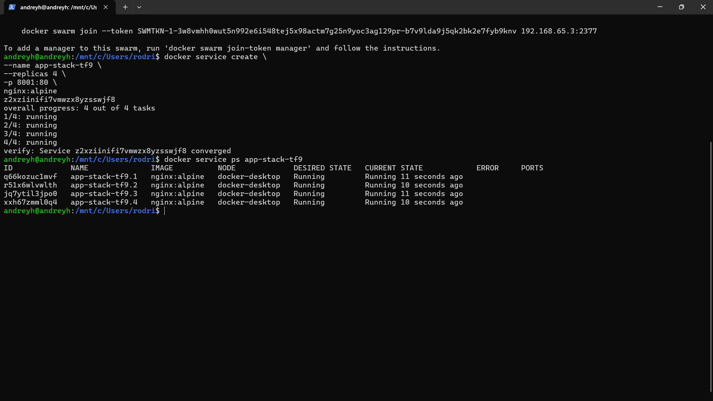
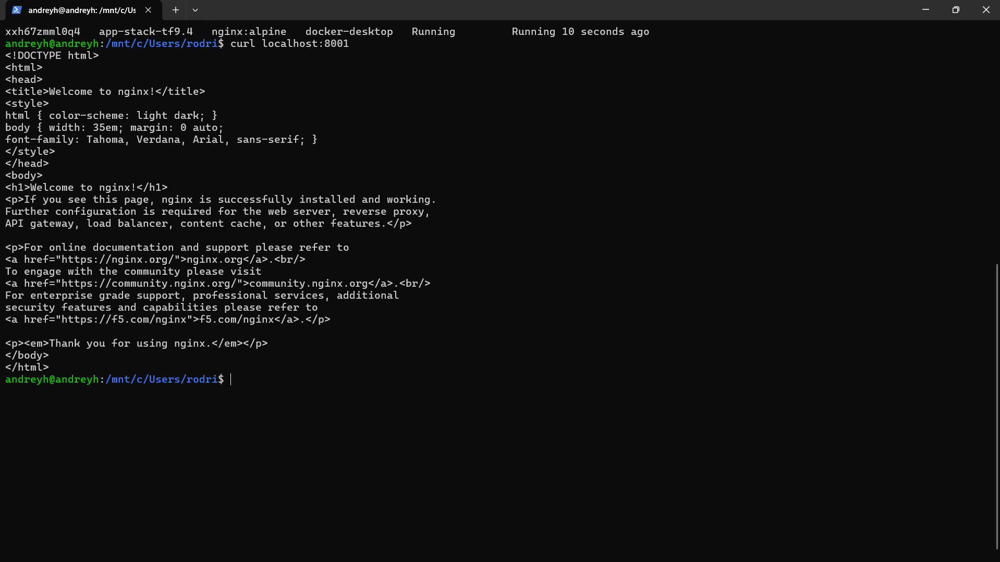

# Tarefa Final - Aula 8

## Questão 1

Docker Compose funciona em um único host, enquanto o Docker Swarm gerencia containers em um cluster de máquinas, permitindo escalabilidade e alta disponibilidade.

## Questão 2

Manager: responsável por gerenciar o cluster, distribuir tarefas e manter o estado desejado.
Worker: responsável por executar os containers (tasks) definidos pelo manager.

## Questão 3

a)
docker swarm init

b)
overlay

## Questão 4

a)
docker service create --name web-escalavel --replicas 3 nginx:alpine

b)
docker service ps web-escalavel

## Questão 5

a)
docker service scale web-escalavel=5

b)
Auto-healing (recuperação automática)

---

## Tarefa Prática

### Passo 1: Inicialização do Cluster

docker swarm leave --force
docker swarm init

---

### Passo 2: Deploy do Serviço

docker service create --name app-stack-tf9 --replicas 4 -p 8001:80 nginx:alpine

---

### Evidência 1

docker service ps app-stack-tf9

---

### Evidência 2

curl localhost:8001

---

### Passo 4: Escalabilidade

docker service scale app-stack-tf9=1

---

### Passo 5: Limpeza

docker service rm app-stack-tf9
docker swarm leave --force
