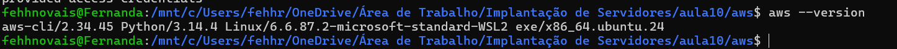
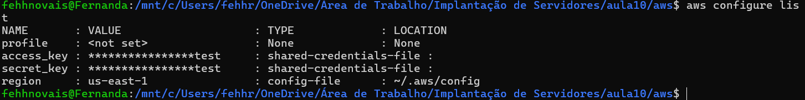
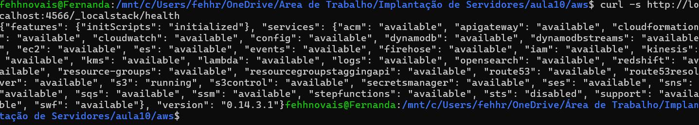
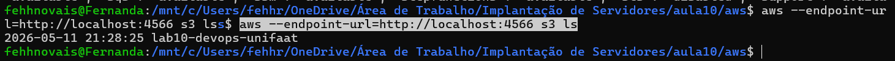
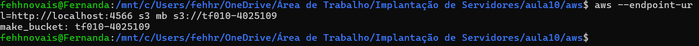
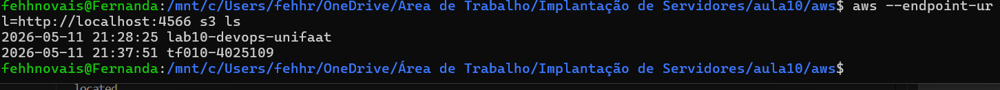
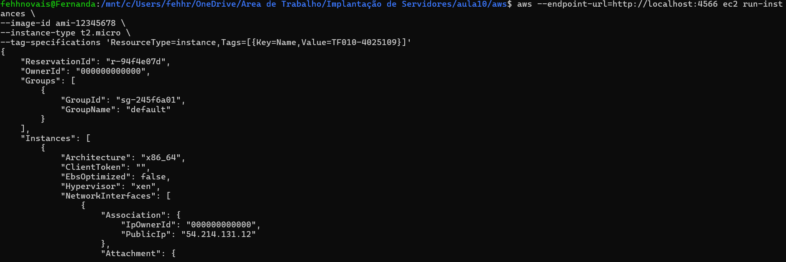
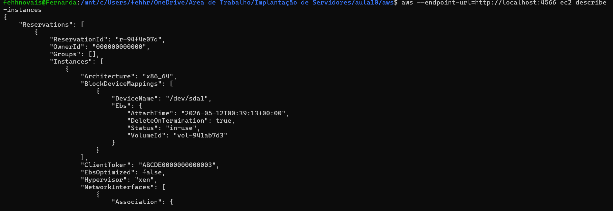

# TF Aula 10

## Nome:FERNANDA 
## RA: 4025109

---

# Questão 1
a)

O serviço Amazon EC2 representa o modelo IaaS (Infrastructure as a Service).

Nesse modelo, o usuário é responsável por gerenciar:

sistema operacional;
instalação de programas;
configurações da máquina.

A AWS fornece apenas a infraestrutura virtual.

b)

Exemplo de serviço PaaS:

AWS Elastic Beanstalk

Exemplo de serviço SaaS:

Amazon WorkDocs

________________________________________________________

# Questão 2
a)
Usuário IAM: representa uma pessoa ou aplicação com permissões próprias.
Grupo IAM: conjunto de usuários que compartilham as mesmas permissões.
b)

Porque a Role IAM fornece permissões temporárias e mais seguras, sem precisar expor chaves de acesso do usuário Root ou Administrador.

________________________________________________________

## Questão 3
a)

Uma Subnet é uma divisão da rede dentro da VPC.

Subnet Pública: possui acesso à internet.
Subnet Privada: não possui acesso direto à internet.
b)
O componente obrigatório para acesso à internet é o Internet Gateway.
O componente usado para controlar tráfego em nível de subnet é o Network ACL (NACL).

________________________________________________________

## Questão 4
a)

O nome dado à imagem do sistema operacional é AMI (Amazon Machine Image).

b)
ssh -i minha_chave.pem ec2-user@54.123.45.67

_______________________________________________________
## aws --version

## aws configure list

## curl -s http://localhost:4566/_localstack/health

## aws --endpoint-url=http://localhost:4566 s3 ls

## aws --endpoint-url=http://localhost:4566 s3 mb s3://tf010-SEU_RA

## aws --endpoint-url=http://localhost:4566 s3 ls

## aws --endpoint-url=http://localhost:4566 ec2 run-instances \image-id ami-12345678 \instance-type t2.micro \tag-specifications 'ResourceType=instance,Tags=[{Key=Name,Value=TF010-SEU_RA}]'

## aws --endpoint-url=http://localhost:4566 ec2 describe-instances

## Comandos principais resumidos

aws --version

aws configure

docker run --rm -it -p 4566:4566 localstack/localstack

curl -s http://localhost:4566/_localstack/health

aws --endpoint-url=http://localhost:4566 s3 ls

aws --endpoint-url=http://localhost:4566 s3 mb s3://tf010-SEU_RA

aws --endpoint-url=http://localhost:4566 ec2 run-instances \
--image-id ami-12345678 \
--instance-type t2.micro \
--tag-specifications 'ResourceType=instance,Tags=[{Key=Name,Value=TF010-SEU_RA}]'

aws --endpoint-url=http://localhost:4566 ec2 describe-instances