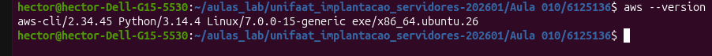
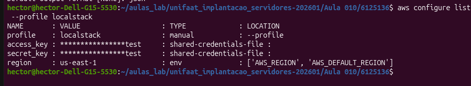
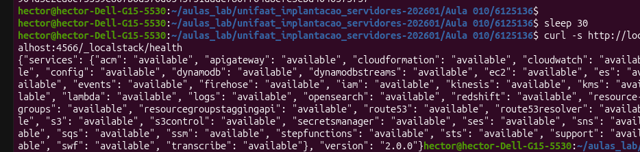
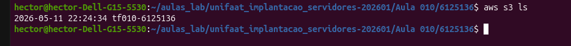
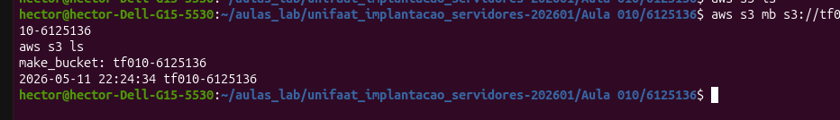
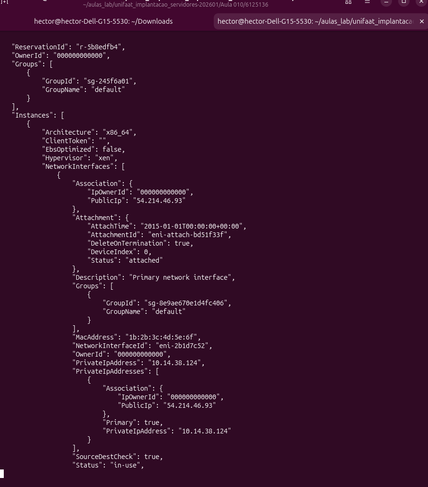
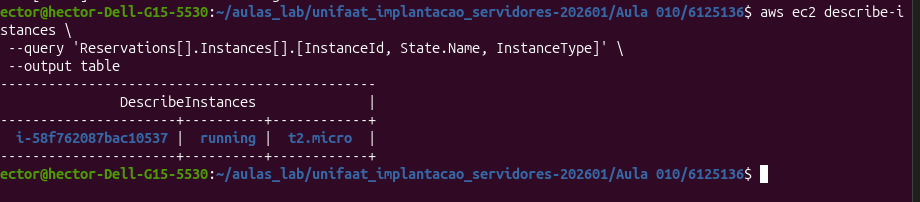

# TF - Aula 10
**RA:** 6125136  
**Disciplina:** Implementação de Servidor e Nuvem (Cloud)

---

## Questão 1 — Modelos de Serviço em Nuvem

**a)** O EC2 representa o modelo **IaaS (Infrastructure as a Service)**. O usuário é responsável por gerenciar o Sistema Operacional, instalar aplicações, configurar segurança e aplicar atualizações. A AWS gerencia apenas o hardware físico e a camada de virtualização.

**b)**
- **PaaS:** AWS Elastic Beanstalk — o usuário sobe o código e a AWS gerencia o ambiente de execução.
- **SaaS:** Amazon WorkMail — serviço de e-mail corporativo pronto para uso, sem necessidade de gerenciar infraestrutura.

---

## Questão 2 — IAM

**a)** Um **Usuário IAM** é uma identidade individual com credenciais próprias (login/senha ou chaves de acesso). Um **Grupo IAM** é um conjunto de usuários que compartilham as mesmas políticas de permissão, facilitando o gerenciamento em escala.

**b)** A **Role IAM** é mais segura porque não utiliza chaves de acesso fixas. Ela gera credenciais temporárias automaticamente, que expiram após um período. Se as chaves de um usuário root ou administrador vazarem, o atacante tem acesso permanente e irrestrito. Com uma Role, o risco é eliminado pois não há chaves expostas no código ou na instância EC2.

---

## Questão 3 — VPC

**a)** Uma **Subnet** é uma subdivisão do bloco de endereços IP de uma VPC.
- **Subnet Pública:** possui rota para um Internet Gateway, permitindo que instâncias se comuniquem com a internet.
- **Subnet Privada:** não possui rota para a internet, sendo usada para recursos internos como bancos de dados e backends.

**b)**
- Para conectar à internet: **Internet Gateway (IGW)**
- Para inspecionar tráfego em nível de subnet: **Network ACL (NACL)**

---

## Questão 4 — Instâncias EC2

**a)** O termo da AWS para a imagem do Sistema Operacional pré-configurado é **AMI (Amazon Machine Image)**.

**b)** Comando para conexão SSH pelo WSL:
```bash
chmod 400 minha_chave.pem
ssh -i minha_chave.pem ec2-user@54.123.45.67
```

---

## Questão 5 — Comandos AWS CLI

**1. Configurar credenciais:**
```bash
aws configure
```

**2. Listar instâncias EC2:**
```bash
aws ec2 describe-instances
```

**3. Criar bucket S3:**
```bash
aws s3 mb s3://meu-bucket-tf10 --region sa-east-1
```

**4. Descrever VPCs:**
```bash
aws ec2 describe-vpcs
```

---

## Questão 6 — Evidências Práticas

### Parte 1 — Configuração

**1. Versão AWS CLI instalada:**



**2. Credenciais configuradas (perfil localstack):**



**3. LocalStack rodando via Docker:**



**4. Teste de conectividade S3:**



---

### Parte 2 — Criação de Recursos

**5. Bucket S3 criado: `tf010-6125136`**



**6. Instância EC2 criada com tag `TF010-6125136`:**



**7. Instância EC2 confirmada em execução:**



---

## Observações

- Utilizado **LocalStack v2.0.0** para simulação do ambiente AWS localmente via Docker.
- Todos os comandos foram executados via **WSL (Ubuntu)** no Windows.
- O perfil `localstack` foi configurado com credenciais de teste (`test/test`) conforme orientação do laboratório.
- A variável `AWS_ENDPOINT_URL` foi exportada para simplificar os comandos sem repetir `--endpoint-url`.
