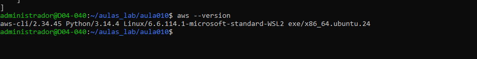
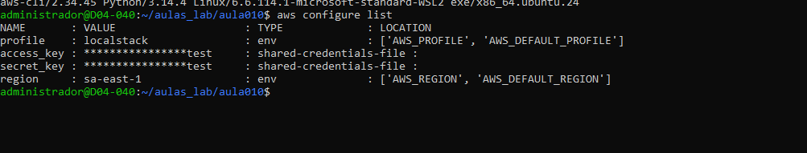
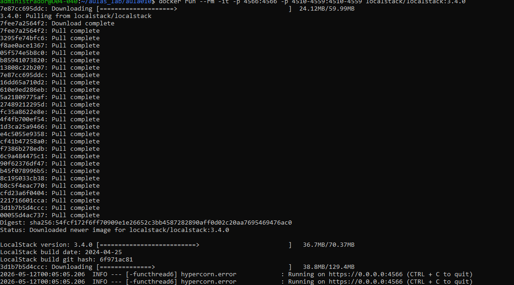
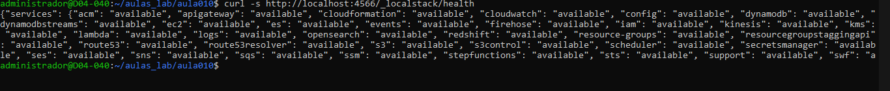
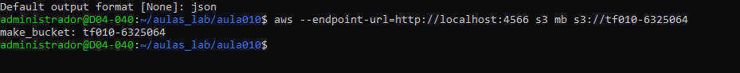
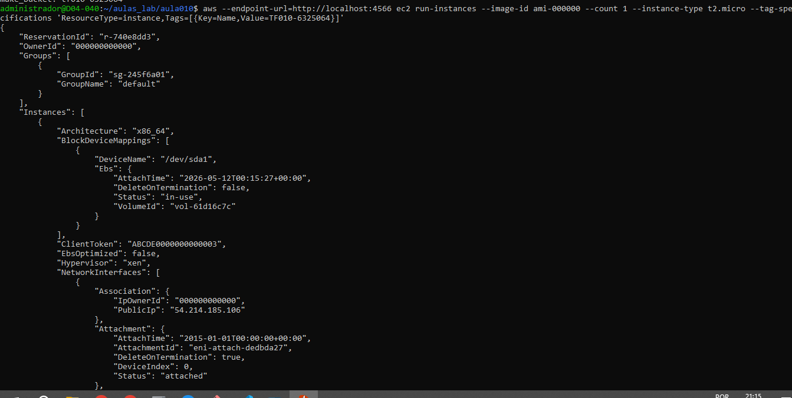
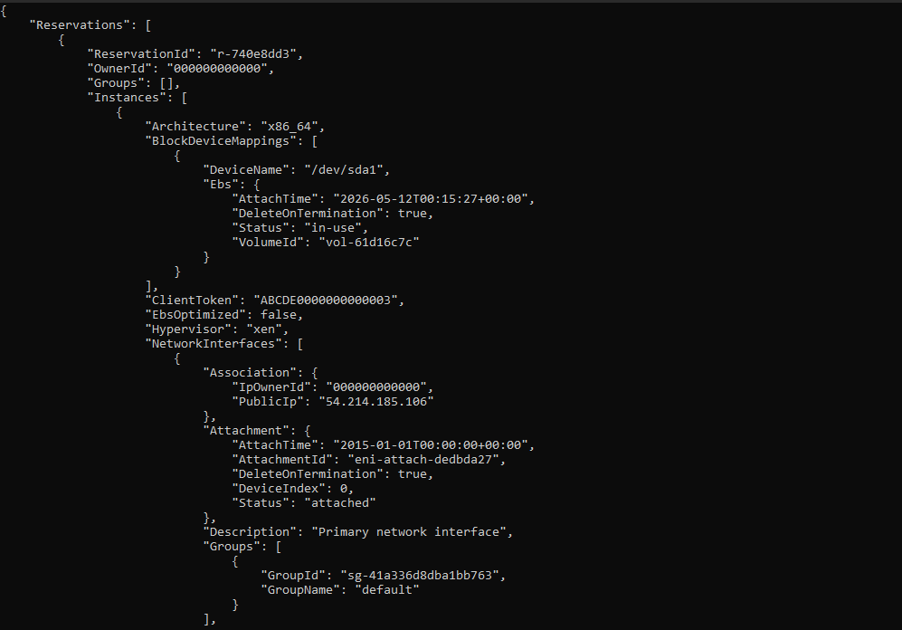

##  Questão 1:

a) O AWS EC2 representa o modelo IaaS (Infrastructure as a Service).

No IaaS, o usuário é responsável por gerenciar do Sistema Operacional para cima. Isso inclui a instalação de patches de segurança no SO, configuração de firewalls (Security Groups), gerenciamento de aplicações e dados. A AWS cuida apenas da infraestrutura física (servidores, rede e virtualização).

b) 
PaaS (Platform as a Service): AWS Elastic Beanstalk ou AWS Lambda.

SaaS (Software as a Service): Amazon Chime ou AWS Marketplace (quando entrega softwares prontos para uso).

## Questão 2:

a)

Usuário IAM: É uma entidade que representa uma pessoa ou serviço que interage com a AWS (possui nome e credenciais).

Grupo IAM: É uma coleção de usuários. Serve para facilitar a gestão, permitindo aplicar permissões (Policies) a vários usuários de uma só vez.

b)

É uma melhor prática porque as Roles fornecem credenciais temporárias de segurança. Usar chaves de acesso (Access Keys) do Root ou Administrador em uma instância EC2 é perigoso, pois se a instância for invadida, as chaves permanentes serão expostas. Com a Role, a instância assume a permissão sem precisar de chaves armazenadas no código ou no disco.

## Questão 3:

a)

Uma Subnet é um intervalo de endereços IP dentro de uma VPC.

Subnet Pública: Possui uma rota para um Internet Gateway (IGW), permitindo acesso direto de/para a internet.

Subnet Privada: Não possui rota direta para a internet. Geralmente usada para bancos de dados ou instâncias que não devem ser expostas.

b)

Para conectar à Internet: Internet Gateway (IGW).

Para inspecionar tráfego (nível de Subnet): NACL (Network Access Control List).

## Questão 4:

a) O termo é AMI (Amazon Machine Image).

b)

ssh -i "minha_chave.pem" ec2-user@54.123.45.67

## Questão 5:

1 Configurar credenciais:
aws configure

2 Listar instâncias EC2:
aws ec2 describe-instances

3 Criar um bucket S3:
aws s3 mb s3://meu-bucket-tf10 --region sa-east-1

4 Descrever VPCs:
aws ec2 describe-vpcs

## Questão 6:

aws --version

aws configure list

docker run --rm -it -p 4566:4566 -p 4510-4559:4510-4559 localstack/localstack:3.4.0

curl -s http://localhost:4566/_localstack/health

## Questão 6:

1- aws --endpoint-url=http://localhost:4566 s3 mb s3://tf010-6325064

2- aws --endpoint-url=http://localhost:4566 ec2 run-instances --image-id ami-000000 --count 1 --instance-type t2.micro --tag-specifications 'ResourceType=instance,Tags=[{Key=Name,Value=TF010-6325064}]'

Nota- aws --endpoint-url=http://localhost:4566 ec2 describe-instances

