# Questão 1: Modelos de Serviço em Nuvem (Teórica)
a. O AWS EC2 é um IaaS. A principal responsabilidade do usuário ao utulizar um AWS EC2 é cuidar do sistema operacional como um todo, desde o OS até o software em execução, não sendo de sua responsabilidade a infraestrutura/hardware;
b. Um exemplo de um serviço SaaS é um Excel Web, e um exemplo de um PaaS é o Office 365 Web como um todo.

# Questão 2: Identidade e Acesso (IAM) (Teórica)
a. Usuário IAM tem as definições aplicadas sobre o usuário enquanto o Grupo IAM tem as definições aplicadas sobre os grupos de usuários;
b. Com as Role IAM podemos definir especificamente a permissão ao usuário/grupo em questão e definir o tempo de ativo de permissão.

# Questão 3: Rede Virtual na AWS (VPC) (Teórica)
a. Uma subnet pública pode ser acessada de qualquer lugar do mundo, possibilitando que qualquer dispositivo entre em contato com nossas instancias. Uma subnet privada possibilita que somente as instancias na mesma subnet consigam se comunicar entre si, não sendo possível que dispositivos externos tenham contato com nossas instancias, sendo assim mais seguro.

# Questão 4: Instâncias EC2 (Prática Teórica)
a. AMI (Amazon Machine Image);
b. ssh -i "minha_chave.pem" ec2-user@54.123.45.67.

# Questão 5: Comandos AWS CLI (Prática)
1. aws configure --profile localstack
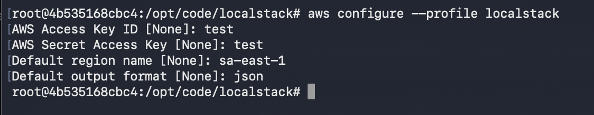
2. aws --endpoint-url=http://localhost:4566 --profile localstack ec2 describe-instances \
  --query 'Reservations[].Instances[].[InstanceId, State.Name, InstanceType]' \
  --output table
  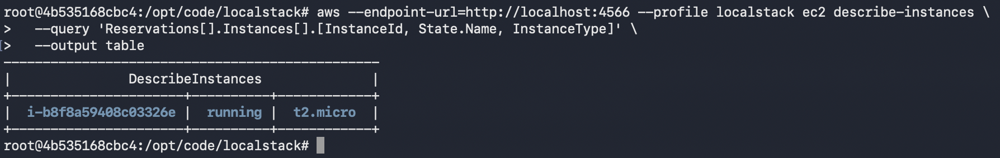
3. aws --endpoint-url=http://localhost:4566 --profile localstack s3 mb s3://meu-bucket-tf10
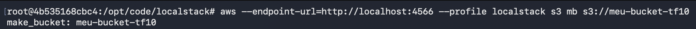
4. aws --endpoint-url=http://localhost:4566 --profile localstack ec2 describe-vpcs
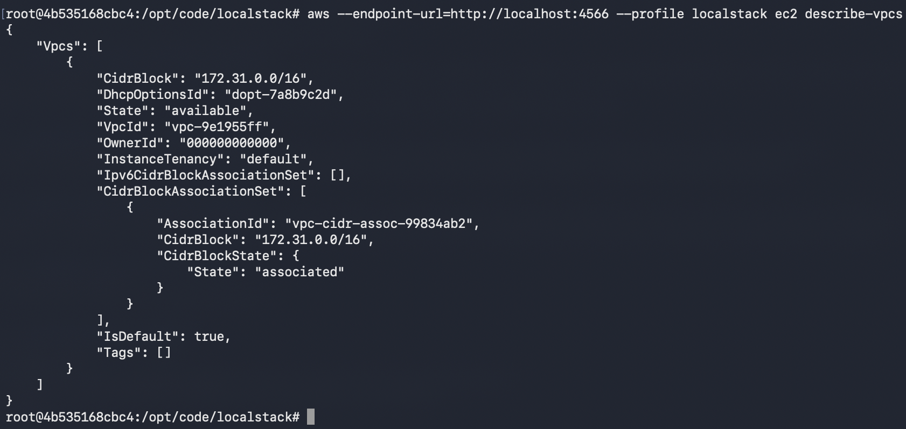

# Questão 6: Evidências Práticas de Configuração e Criação de Recursos
## Parte 1: Evidências de Configuração
1. 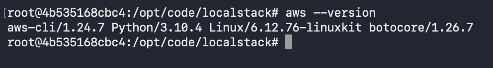
2. 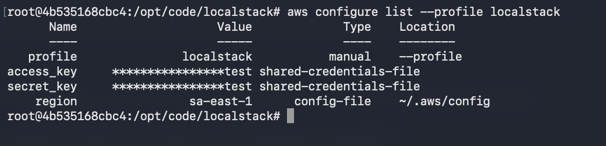
3. 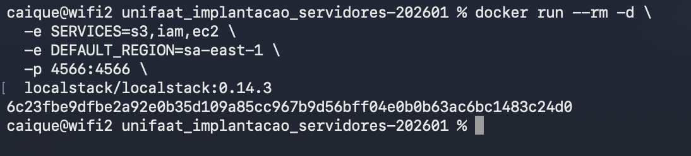 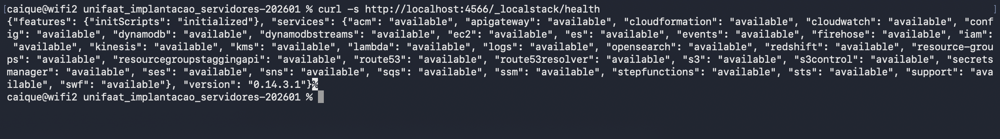
4. 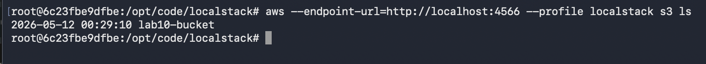

## Parte 2: Exercício de Criação de Recursos
1. 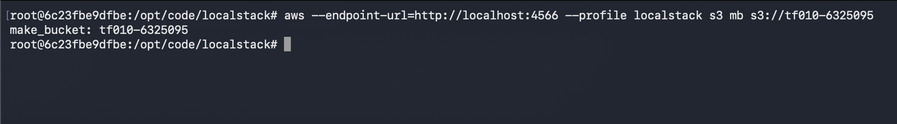
2. 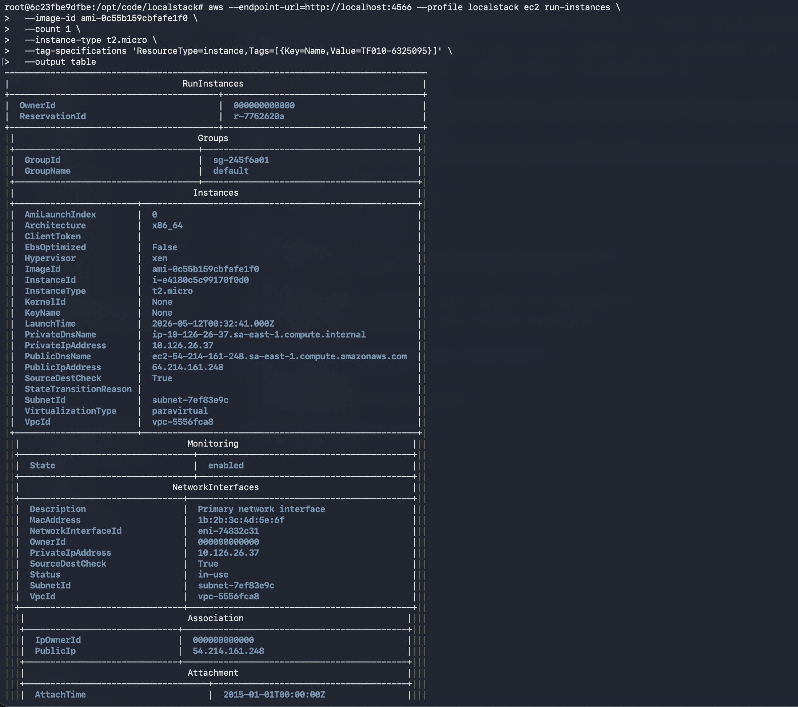 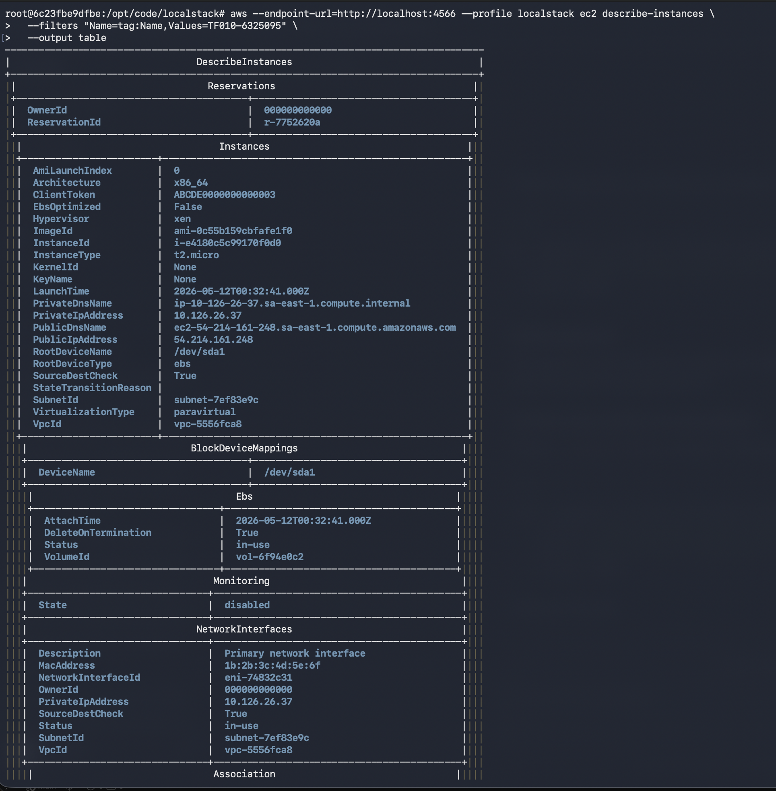
