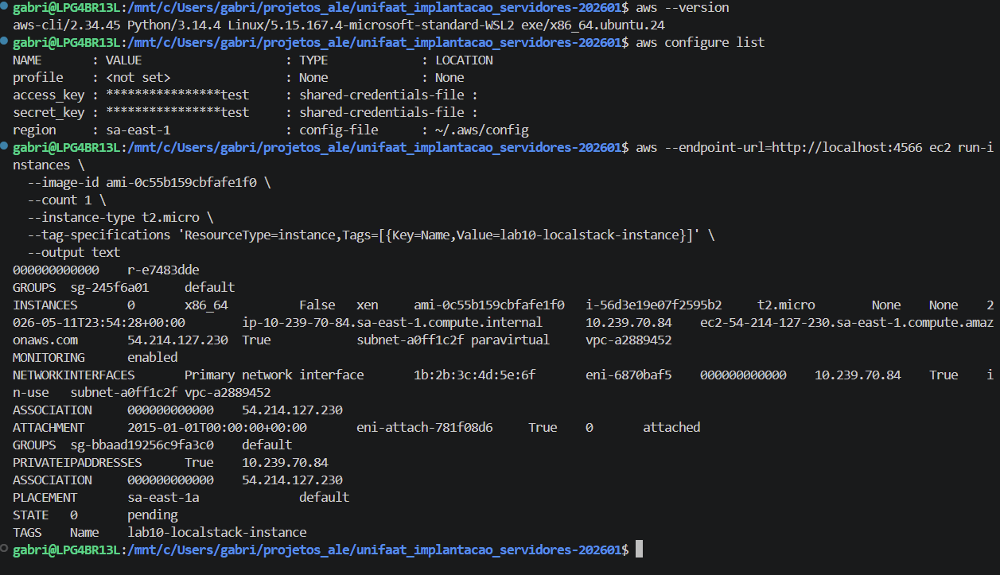
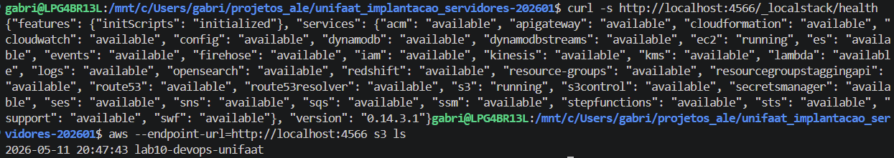
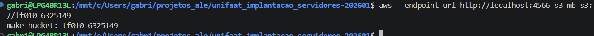
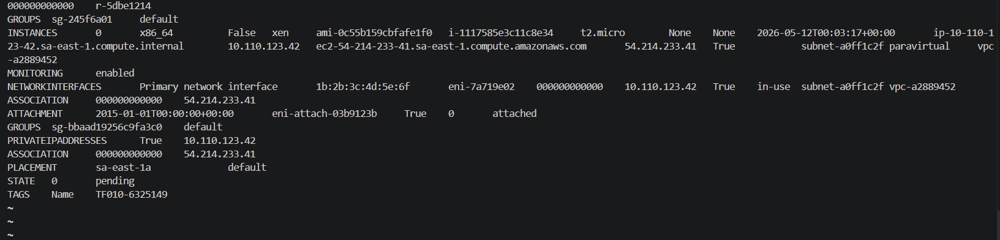
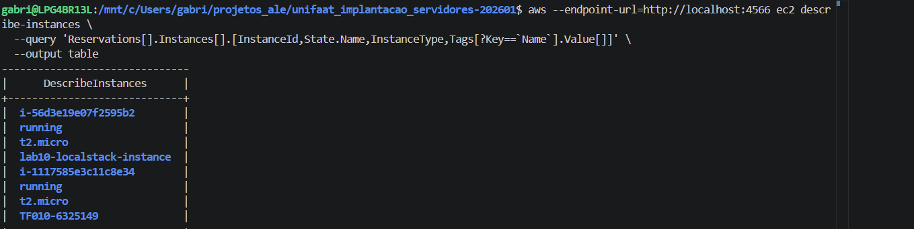

# TF010 - Respostas: Conceitos de Infraestrutura em Nuvem e AWS

**RA:** 6325149  
**Data:** 11/05/2026  
**Disciplina:** Implementação de servidor e nuvem (cloud)  

---

## Questão 1: Modelos de Serviço em Nuvem (Teórica)

### a) Qual modelo EC2 representa e qual é a principal responsabilidade do usuário?

**Resposta:**

O AWS EC2 (Elastic Compute Cloud) representa o modelo **IaaS (Infrastructure as a Service)**.

**Principal responsabilidade do usuário neste modelo:**
- Gerenciar o **Sistema Operacional** e tudo acima dele
- Instalar patches e atualizações do OS
- Instalar e configurar aplicações
- Configurar firewalls e redes
- Gerenciar dados e backup
- Otimizar performance

**O que a AWS gerencia:**
- Infraestrutura física (data centers, hardware)
- Hypervisor e virtualização
- Rede básica

**Analogia:** Como alugar um apartamento vazio - você traz os móveis (software) e mantém tudo funcional.

---

### b) Cite um exemplo de serviço AWS em modelo SaaS ou PaaS

**Resposta:**

**Exemplo PaaS - AWS Elastic Beanstalk:**
- Plataforma gerenciada para deploy de aplicações
- AWS gerencia: O.S., runtime, middleware, infraestrutura
- Você gerencia: código da aplicação e dados

**Exemplo SaaS - Amazon Chime:**
- Serviço de videoconferência e comunicação
- AWS gerencia: toda a aplicação, servidor, infraestrutura
- Você gerencia: apenas seus dados e configurações de conta

---

## Questão 2: Identidade e Acesso (IAM) (Teórica)

### a) Qual é a diferença fundamental entre Usuário IAM e Grupo IAM?

**Resposta:**

| Aspecto | Usuário IAM | Grupo IAM |
|---------|-----------|----------|
| **Definição** | Identidade individual com credenciais únicas | Coleção de múltiplos usuários |
| **Credenciais** | Possui Access Key ID e Secret Access Key próprias | Não possui credenciais próprias |
| **Permissões** | Recebe políticas individuais ou herda de grupos | Define permissões herdadas por membros |
| **Caso de Uso** | Pessoas, aplicações ou serviços específicos | Organizar usuários por função/departamento |
| **Escalabilidade** | Tedioso gerenciar muitos usuários individualmente | Eficiente para gerenciar centenas de usuários |

**Exemplo prático:**
- **Usuário:** `joao@empresa.com` (desenvolvedor)
- **Grupo:** `developers` (todos os developers recebem mesmas permissões S3 + EC2)

---

### b) Por que usar Role IAM em vez de chaves de usuário Root/Admin para EC2?

**Resposta:**

**Razões de Segurança:**

1. **Least Privilege Principle (Princípio do Menor Privilégio)**
   - Role define permissões específicas (ex: apenas S3 ReadOnly)
   - Chaves Root têm acesso total a toda a conta

2. **Separação de Responsabilidades**
   - Root/Admin = Conta AWS
   - Role = Instância EC2 específica
   - Se EC2 for comprometida, attacker não acessa toda conta

3. **Rotação de Credenciais**
   - Role: Credenciais temporárias (renovadas automaticamente a cada hora)
   - Chaves: Estáticas, comprometidas indefinidamente se vazarem

4. **Auditoria e Rastreamento**
   - CloudTrail registra qual Role executou qual ação
   - Facilita identificação de violações

5. **Evitar Vazamento de Credenciais**
   - Chaves podem ser extraídas da instância por malware
   - Role usa credenciais temporárias invisíveis ao OS

**Exemplo:**
```json
{
  "Version": "2012-10-17",
  "Statement": [
    {
      "Effect": "Allow",
      "Action": "s3:GetObject",
      "Resource": "arn:aws:s3:::app-data/*"
    }
  ]
}
```
A EC2 acessa apenas objetos em `app-data`, nada mais.

---

## Questão 3: Rede Virtual na AWS (VPC) (Teórica)

### a) Defina Subnet e diferencie Subnet Pública de Privada

**Resposta:**

**Subnet - Definição:**
Uma **Subnet** é um segmento de rede dentro de uma VPC. É uma subdivisão do espaço de IP (CIDR block) que delimita limites de segurança, isolamento e roteamento.

**Diferenças Cruciais:**

| Característica | Subnet Pública | Subnet Privada |
|---|---|---|
| **Acesso à Internet** | ✅ SIM (via Internet Gateway) | ❌ NÃO direto |
| **IP Público** | Instâncias recebem IPs públicos | Apenas IPs privados |
| **Use Case** | Web servers, load balancers | Bancos de dados, backend |
| **Route Table** | Aponta para Internet Gateway | Aponta para NAT Gateway |
| **Saída para Internet** | Direta | Via NAT Gateway em subnet pública |
| **Inbound direto** | Possível (se Security Group permite) | Apenas de dentro da VPC |

**Arquitetura típica:**
```
Internet
    ↓
Internet Gateway
    ↓
Subnet Pública (Web Server - 10.0.1.0/24)
    ↓
NAT Gateway
    ↓
Subnet Privada (Database - 10.0.2.0/24)
```

---

### b) Qual componente é obrigatório para internet? Qual inspeciona tráfego?

**Resposta:**

**Componente OBRIGATÓRIO para Subnet Pública acessar Internet:**
- **Internet Gateway (IGW)**
  - Permite comunicação bidirecional entre VPC e internet
  - Deve estar associado à VPC
  - Route table da subnet pública deve ter: `0.0.0.0/0 → IGW`

**Componente para INSPECIONAR tráfego de Subnet:**
- **Network ACL (Access Control List)**
  - Firewall de nível de subnet (stateless)
  - Controla tráfego de entrada E saída
  - Funciona como um filtro de pacotes antes de chegar à instância

**Diferença com Security Group:**
- **Security Group**: Firewall de nível de instância (stateful)
- **NACL**: Firewall de nível de subnet (stateless)

**Exemplo NACL:**
```
Regra 100: ALLOW TCP porta 80 (HTTP)
Regra 110: ALLOW TCP porta 443 (HTTPS)
Regra 120: DENY TCP porta 22 (SSH bloqueado)
Regra 130: ALLOW retorno de conexões
```

---

## Questão 4: Instâncias EC2 (Prática Teórica)

### a) Qual é o termo AWS para imagem do S.O. pré-configurado?

**Resposta:**

O termo é **AMI (Amazon Machine Image)**.

**O que é uma AMI:**
- Imagem template pré-configurada do Sistema Operacional
- Contém: OS, aplicações, dependências, configs
- Pronta para ser lançada como uma instância EC2

**Tipos de AMIs:**
- **AWS-owned**: Fornecidas pela Amazon (Ubuntu, Amazon Linux, Windows)
- **Community AMIs**: Criadas por usuários
- **Marketplace**: AMIs comerciais com software pré-instalado
- **Custom**: Criadas por você a partir de instâncias existentes

**Exemplos:**
- `ami-0c55b159cbfafe1f0` - Ubuntu 20.04 LTS
- `ami-0123456789abcdef0` - Amazon Linux 2

---

### b) Qual comando SSH para conectar a uma instância Ubuntu?

**Resposta:**

```bash
ssh -i minha_chave.pem ec2-user@54.123.45.67
```

**Componentes do comando:**
- `ssh` - Protocolo Secure Shell
- `-i minha_chave.pem` - Arquivo de chave privada
- `ec2-user` - Usuário padrão (para Amazon Linux/RHEL)
  - Para Ubuntu: use `ubuntu` (não `ec2-user`)
- `54.123.45.67` - Endereço IP público da instância

**Comando CORRETO para Ubuntu:**
```bash
ssh -i minha_chave.pem ubuntu@54.123.45.67
```

**Pré-requisitos:**
1. Security Group permite porta 22 (SSH)
2. Arquivo `minha_chave.pem` tem permissão 400:
   ```bash
   chmod 400 minha_chave.pem
   ```
3. Instância está em estado `running`

---

## Questão 5: Comandos AWS CLI (Prática)

### Resposta aos 4 comandos práticos:

#### 1. Configurar credenciais
```bash
aws configure
# Insira:
# AWS Access Key ID: [sua_access_key]
# AWS Secret Access Key: [sua_secret_key]
# Default region name: sa-east-1
# Default output format: json
```

**Alternativa (sem prompt interativo):**
```bash
aws configure set aws_access_key_id YOUR_KEY
aws configure set aws_secret_access_key YOUR_SECRET
aws configure set region sa-east-1
aws configure set output json
```

---

#### 2. Listar instâncias EC2
```bash
aws ec2 describe-instances \
  --query 'Reservations[].Instances[].[InstanceId,State.Name,InstanceType]' \
  --output table
```

**Saída esperada:**
```
|  InstanceId   | State  | InstanceType |
|---------------|--------|-------------|
|  i-0123456789 | running | t2.micro    |
|  i-9876543210 | stopped | t3.small    |
```

**Variações úteis:**
```bash
# Apenas IDs
aws ec2 describe-instances --query 'Reservations[].Instances[].InstanceId' --output text

# Com tags
aws ec2 describe-instances --query 'Reservations[].Instances[].[InstanceId,Tags[?Key==`Name`].Value[]]'
```

---

#### 3. Criar bucket S3
```bash
aws s3 mb s3://meu-bucket-tf10-6325149 --region sa-east-1
```

**Requisitos:**
- Nome globalmente único (em toda a AWS)
- Apenas letras minúsculas, hífens e números
- Sem underscores ou pontos

**Validar criação:**
```bash
aws s3 ls | grep meu-bucket-tf10
```

---

#### 4. Descrever VPCs
```bash
aws ec2 describe-vpcs \
  --query 'Vpcs[].[VpcId,CidrBlock,IsDefault]' \
  --output table
```

**Saída esperada:**
```
|     VpcId    | CidrBlock     | IsDefault |
|--------------|---------------|-----------|
| vpc-1234567  | 10.0.0.0/16   | False     |
| vpc-abcdefg  | 172.31.0.0/16 | True      |
```

**Listar apenas VPC padrão:**
```bash
aws ec2 describe-vpcs --filters Name=isDefault,Values=true --query 'Vpcs[].VpcId'
```

---

## Questão 6: Evidências Práticas de Configuração e Criação de Recursos

### Parte 1: Evidências de Configuração

#### 1. Instalação da AWS CLI

**Comando:** `aws --version`



**Descrição:** Confirma que AWS CLI versão 2.x está instalada e operacional no ambiente WSL/Linux.

---

#### 2. Configuração de Credenciais AWS

**Comando:** `aws configure list`



**Descrição:** Mostra as credenciais configuradas (Access Key e Secret Key ofuscadas por segurança), região padrão `sa-east-1` e tipo de armazenamento (`shared-credentials-file`).

---

#### 3. Instalação do LocalStack via Docker

**Comando:** `docker ps` (verificar container LocalStack ativo)



**Descrição:** Confirma que o container LocalStack está rodando na porta `4566`, fornecendo emulação dos serviços AWS localmente.

---

#### 4. Teste de Conectividade LocalStack

**Comando:** `aws --endpoint-url=http://localhost:4566 s3 ls`



**Descrição:** Confirma que a conectividade com LocalStack está funcionando. O comando lista buckets S3 existentes no LocalStack.

---

### Parte 2: Exercício de Criação de Recursos

#### 1. Criar um Bucket S3 com nome TF010

**Comando:**
```bash
aws --endpoint-url=http://localhost:4566 s3 mb s3://tf010-6325149
```

**Saída:** `make_bucket: tf010-6325149`

**Descrição:** Bucket S3 criado com sucesso no LocalStack com o nome `tf010-6325149`, seguindo o padrão `tf010-<RA>`.

---

#### 2. Criar uma Instância EC2 com tag TF010

**Comando:**
```bash
aws --endpoint-url=http://localhost:4566 ec2 run-instances \
  --image-id ami-0c55b159cbfafe1f0 \
  --count 1 \
  --instance-type t2.micro \
  --tag-specifications 'ResourceType=instance,Tags=[{Key=Name,Value=TF010-6325149}]' \
  --output text
```

**Saída - Instância Criada:**



**Descrição:** Instância EC2 criada com sucesso no LocalStack com as seguintes características:
- **Image ID:** ami-0c55b159cbfafe1f0
- **Instance Type:** t2.micro
- **Tag Name:** TF010-6325149
- **Estado:** pending (logo estará running)

---

#### Verificação da Instância EC2

**Comando:**
```bash
aws --endpoint-url=http://localhost:4566 ec2 describe-instances \
  --query 'Reservations[].Instances[].[InstanceId,State.Name,InstanceType,Tags[?Key==`Name`].Value[]]' \
  --output table
```

**Descrição:** Comando de verificação que lista todas as instâncias EC2 criadas com suas informações de estado e tags.

---

## Observações Sobre as Ferramentas e Comandos Usados

### AWS CLI
- **Versão:** 2.x (versão mais recente com suporte completo a AWS)
- **Região:** `sa-east-1` (São Paulo - menor latência para Brasil)
- **Endpoint LocalStack:** `http://localhost:4566` (emulador local)

### LocalStack
- **Versão:** 0.14.3 (versão gratuita com suporte a S3, IAM, EC2)
- **Serviços emulados:** S3, IAM, EC2
- **Porta:** 4566
- **Vantagens:** Testes offline, sem custos, desenvolvimento rápido

### Comandos Práticos Utilizados

1. **AWS CLI Configuration:**
   ```bash
   aws configure
   ```
   - Configura credenciais, região e formato de saída

2. **S3 Operations:**
   ```bash
   aws --endpoint-url=http://localhost:4566 s3 mb s3://tf010-6325149
   ```
   - Cria bucket S3 no LocalStack

3. **EC2 Operations:**
   ```bash
   aws --endpoint-url=http://localhost:4566 ec2 run-instances
   ```
   - Cria instância EC2 no LocalStack com tags

4. **Query JMESPath:**
   - Usado `--query` para filtrar e formatar saídas
   - Exemplo: `'Reservations[].Instances[].[InstanceId,State.Name,InstanceType]'`

### Fluxo de Trabalho Implementado

```
1. Instalar AWS CLI
   ↓
2. Configurar Credenciais
   ↓
3. Iniciar LocalStack (Docker)
   ↓
4. Testar Conectividade
   ↓
5. Criar Bucket S3
   ↓
6. Criar Instância EC2
   ↓
7. Verificar Recursos Criados
   ↓
8. Coletar Evidências (Prints)
```

### Conceitos-Chave Demonstrados

✅ **IaaS com EC2:** Instância EC2 criada sob demanda  
✅ **S3 Storage:** Bucket criado e gerenciado via CLI  
✅ **Tagging:** Tags adicionadas para organização de recursos  
✅ **Infrastructure as Code:** Comandos que podem ser automatizados  
✅ **DevOps:** Gerenciamento via linha de comando  
✅ **LocalStack:** Desenvolvimento local antes de produção  

---

**Data de Conclusão:** 11/05/2026  
**Status:** ✅ Questões Teóricas Completas | ✅ Evidências Práticas Capturadas e Integradas  
**Artefatos:** Imagens de evidência armazenadas em `/images/`
