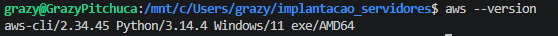
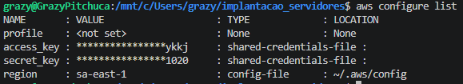
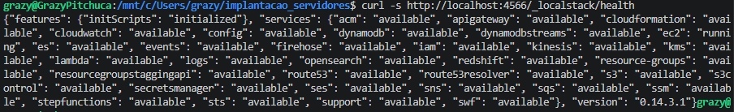
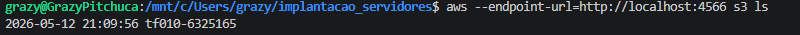
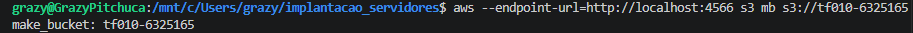
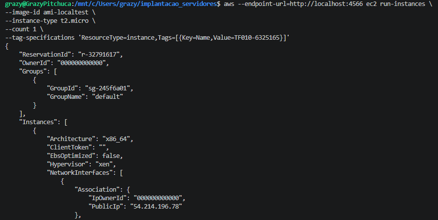
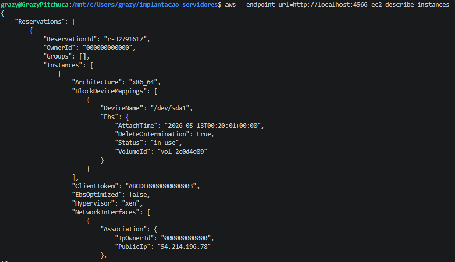

QUESTÃO 1
a)

O EC2 representa o modelo:

IaaS (Infrastructure as a Service)

Responsabilidade do usuário:

Gerenciar sistema operacional
Instalar softwares
Configurar rede
Atualizações e segurança da VM

b)

Exemplo SaaS:

Google Workspace

Exemplo PaaS:

AWS Elastic Beanstalk

QUESTÃO 2
a)

Usuário IAM:

Representa uma pessoa/aplicação
Possui login e permissões próprias

Grupo IAM:

Conjunto de usuários
Facilita gerenciamento de permissões
b)

Roles IAM são mais seguras porque:

Não usam chaves fixas
Credenciais são temporárias
Reduz risco de vazamento
Segue princípio do menor privilégio

QUESTÃO 3
a)

Subnet:

Divisão lógica da VPC

Subnet Pública:

Possui acesso à internet

Subnet Privada:

Não possui acesso direto à internet
b)

Componente obrigatório:

Internet Gateway (IGW)

Componente de inspeção:

Network ACL (NACL)

QUESTÃO 4
a)

Termo usado:

AMI (Amazon Machine Image)
b)

Comando SSH:

ssh -i minha_chave.pem ec2-user@54.123.45.67

QUESTÃO 5
1. Configurar credenciais
aws configure
2. Listar instâncias
aws ec2 describe-instances
3. Criar bucket
aws s3api create-bucket \
--bucket meu-bucket-tf10 \
--region sa-east-1 \
--create-bucket-configuration LocationConstraint=sa-east-1
4. Descrever VPCs
aws ec2 describe-vpcs

Evidência 1 — AWS CLI

Evidência 2 — AWS Configure

Evidência 3 — LocalStack

Evidência 4 — S3 LS

Evidência 5 — Bucket TF010

Evidência 6 — EC2 Run Instances

Evidência 7 — Describe Instances

