Questão 1: Modelos de Serviço em Nuvem (Teórica)
a) Qual modelo de serviço a AWS EC2 (Elastic Compute Cloud) representa (IaaS, PaaS ou SaaS)? Explique qual é a principal responsabilidade do usuário neste modelo (ex: gerenciar o Sistema Operacional ou apenas usar o software?).
R:A AWS EC2 representa o modelo IaaS (Infrastructure as a Service). Nesse modelo, o usuário é responsável por gerenciar o Sistema Operacional, instalar softwares e configurar a instância.

b) Cite um exemplo de serviço da AWS que se encaixe no modelo SaaS (Software as a Service) ou PaaS (Platform as a Service).
R:Um exemplo de PaaS é o Elastic Beanstalk. Um exemplo de SaaS é o Amazon WorkDocs.

Questão 2: Identidade e Acesso (IAM) (Teórica)
a) Qual é a diferença fundamental entre um Usuário IAM e um Grupo IAM?
R:O Usuário IAM representa uma pessoa ou aplicação com credenciais próprias. O Grupo IAM reúne vários usuários para facilitar o gerenciamento de permissões.

b) No contexto de segurança, explique por que é uma melhor prática criar uma Role IAM em vez de usar as chaves de um usuário Root ou Administrador para dar permissão a uma instância EC2 acessar um serviço como o S3.
R:A Role IAM é mais segura porque usa credenciais temporárias e evita armazenar chaves fixas dentro da instância EC2.

Questão 3: Rede Virtual na AWS (VPC) (Teórica)
a) Defina o conceito de Subnet dentro de uma VPC e explique a diferença crucial entre uma Subnet Pública e uma Subnet Privada.
R:Uma Subnet é uma divisão da rede dentro da VPC. A Subnet Pública possui acesso à Internet, enquanto a Privada não possui acesso direto.

b) Qual componente de rede é obrigatório para que uma instância EC2 em uma Subnet Pública consiga se conectar à Internet (enviar e receber tráfego) e qual componente é usado para inspecionar o tráfego de entrada/saída em nível de Subnet?
R:O componente obrigatório é o Internet Gateway (IGW). O componente usado para controlar o tráfego da Subnet é a Network ACL (NACL).

Questão 4: Instâncias EC2 (Prática Teórica)
a) Ao lançar uma instância EC2, qual é o termo da AWS para a imagem do Sistema Operacional pré-configurado que você utiliza (ex: Ubuntu, Amazon Linux)?
R:O termo usado pela AWS é AMI (Amazon Machine Image).

b) Após lançar uma instância Linux (Ubuntu) e garantir que a porta 22 esteja aberta, qual comando Linux você usaria no seu terminal WSL para se conectar a esta instância usando o arquivo de chave minha_chave.pem? (Assuma que o endereço público da instância é ec2-user@54.123.45.67).
R:ssh -i minha_chave.pem ec2-user@54.123.45.67

Questão 5: Comandos AWS CLI (Prática)
Configurar credenciais: Qual comando AWS CLI é usado para configurar as credenciais e região no seu ambiente local?
R:aws configure

Listar instâncias EC2: Qual comando AWS CLI você usaria para listar todas as instâncias EC2 na região configurada?
R:aws ec2 describe-instances

Criar um bucket S3: Qual comando AWS CLI cria um bucket chamado meu-bucket-tf10 na região sa-east-1?
R:aws s3api create-bucket --bucket meu-bucket-tf10 --region sa-east-1 --create-bucket-configuration LocationConstraint=sa-east-1

Descrever VPCs: Qual comando AWS CLI retorna as informações das VPCs existentes na região configurada?
R:aws ec2 describe-vpcs

Questão 6: Evidências Práticas de Configuração e Criação de Recursos
Para esta questão, você deve fornecer evidências práticas baseadas no laboratório (Lab010.md). Use a AWS real ou LocalStack para executar os comandos e capture prints das saídas.

Parte 1: Evidências de Configuração
Forneça prints (screenshots) das seguintes configurações no seu ambiente WSL/Linux:
Instalação da AWS CLI: Print do comando aws --version mostrando a versão instalada.
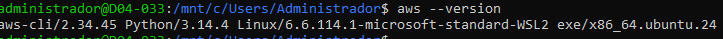

Configuração de Credenciais AWS: Print do comando aws configure list mostrando as credenciais configuradas (oculte chaves sensíveis).
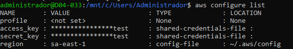

Instalação do LocalStack via Docker: Print do comando docker run iniciando o LocalStack e um print do curl -s http://localhost:4566/_localstack/health confirmando que está rodando.
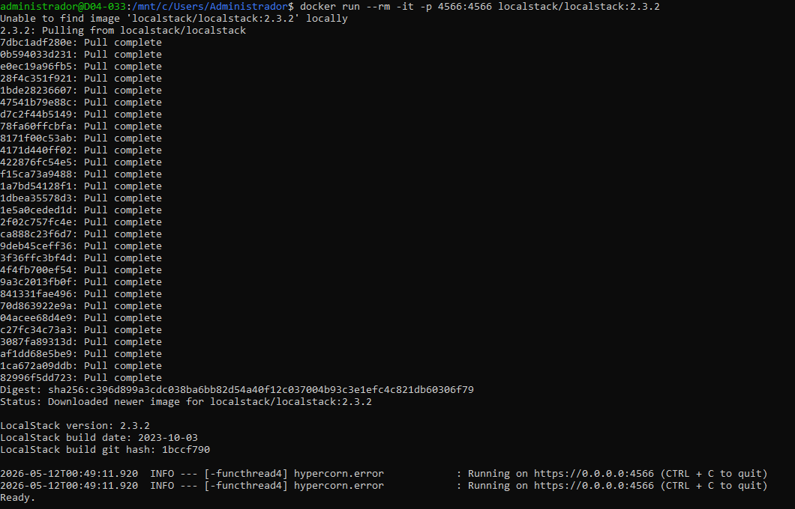
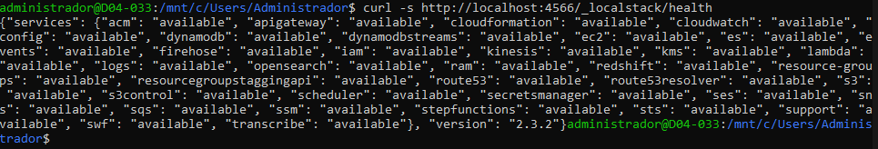

Teste de Conectividade LocalStack: Print do comando aws --endpoint-url=http://localhost:4566 s3 ls mostrando a conectividade.
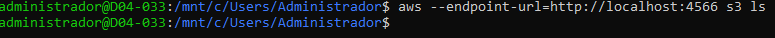

Parte 2: Exercício de Criação de Recursos
Execute os seguintes passos na AWS real ou LocalStack e forneça prints das evidências:
Criar um Bucket S3 com nome TF010: Use o comando apropriado para criar um bucket chamado tf010-<seu-ra> (ex: tf010-6325128). Forneça print do comando e da saída confirmando a criação.
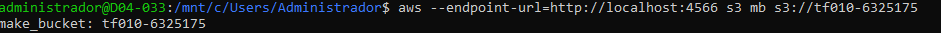

Criar uma Instância EC2 com tag TF010: Use o comando para criar uma instância EC2 com tag Name=TF010-<seu-ra>. Forneça print do comando run-instances e um print do describe-instances mostrando a instância criada.
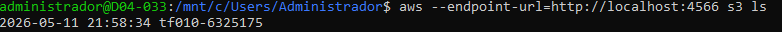
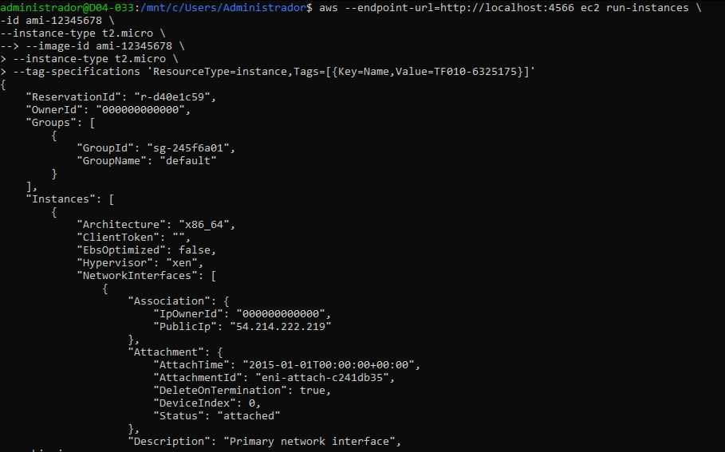 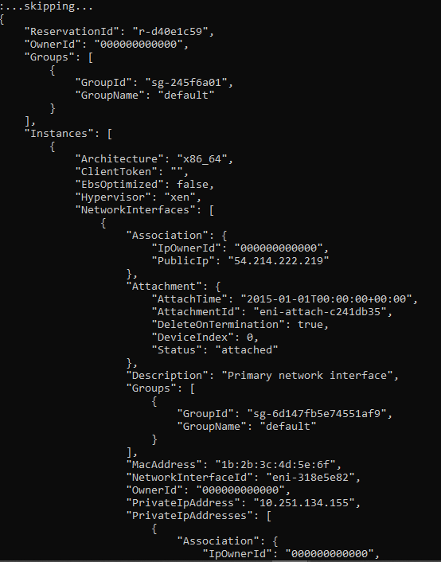
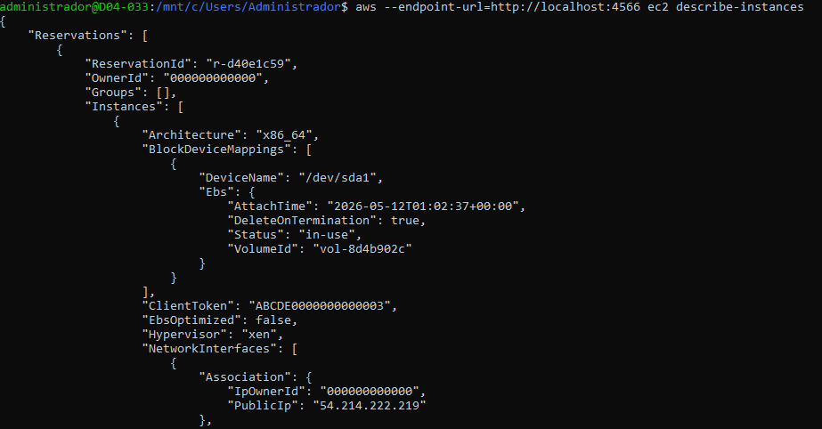 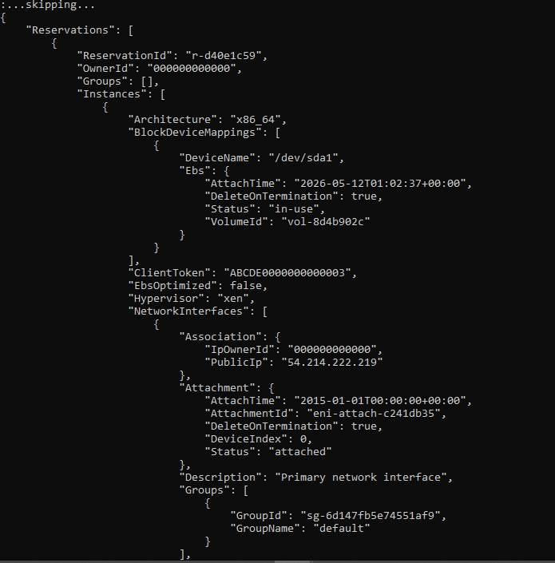