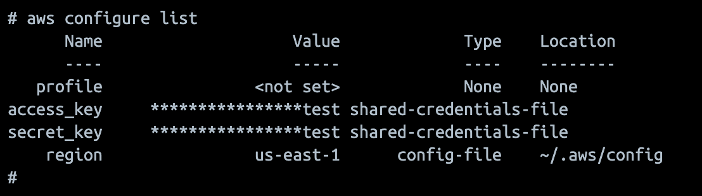
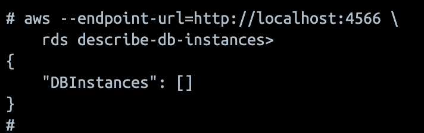

## Questão 1: Armazenamento de Objetos (S3) (Teórica)
a) Armazenar arquivos estáticos, como imagens, vídeos, backups e hospedar sites estáticos.
b) É global, mas os dados ficam em uma região específica. Os "onze noves" representam a durabilidade.

## Questão 2: Armazenamento de Blocos vs. Arquivos (EBS/EFS) (Teórica)
a) O EBS é anexado a uma única instância (armazenamento de bloco). O EFS pode ser montado em várias instâncias ao mesmo tempo (sistema de arquivos compartilhado).
b) EBS.

## Questão 3: Banco de Dados Gerenciado (RDS) (Teórica)
a) Backups automatizados e aplicação de patches no sistema e no banco.
b) Não temos acesso ao sistema operacional (sem acesso SSH) para configurações muito customizadas.

## Questão 4: Alta Disponibilidade no RDS (Teórica)
a) Ocorre a replicação síncrona dos dados para uma instância standby em outra Zona de Disponibilidade (AZ).
b) O standby fica aguardando uma falha para assumir (failover) e não permite leituras. A Read Replica é usada para receber e escalar o tráfego de leitura.

## Questão 5: Tarefa Prática Integrada (Simulação com AWS CLI)
1. `touch db_config.conf`
2. `aws s3 cp db_config.conf s3://config-app-tf11/`
3. `aws s3 ls s3://config-app-tf11/`

## Questão 6:
### Parte 1:
1. 
2. 