Relatório de Prática: Provisionamento, Conexão e Manipulação de Dados no RDS PostgreSQL

Aluno: Carina Dalpino
RA: [6325109]
Atividade: Aula 011 - Banco de Dados Relacional na Nuvem (AWS RDS)

---

## Questão 1: Armazenamento de Objetos (S3) (Teórica)

**a) Qual é o principal caso de uso para o S3 em um contexto de aplicação Web e DevOps?**
O armazenamento de arquivos estáticos (como imagens, vídeos, arquivos CSS, JavaScript), armazenamento de backups (snapshots), logs de servidores e hospedagem de sites estáticos. Ele não serve para hospedar sistemas operacionais, pois não é um sistema de arquivos de blocos.

**b) O S3 é um serviço global ou regional? Qual característica do S3 (durabilidade ou disponibilidade) é expressa pela taxa "Onze Noves" (99.999999999%)?**
O S3 possui escopo **Global** em termos de gerenciamento de nomes de buckets (que são únicos mundialmente), mas os dados são armazenados de forma **Regional** no bucket escolhido. A taxa de "Onze Noves" expressa a **Durabilidade** dos dados (a garantia de que o dado não será perdido ou corrompido).

---

## Questão 2: Armazenamento de Blocos vs. Arquivos (EBS/EFS) (Teórica)

**a) Qual é a diferença fundamental entre o Amazon EBS e o Amazon EFS em termos de conexão e uso por instâncias EC2?**
O **Amazon EBS** é um armazenamento em blocos de alta performance feito para ser conectado a **uma única instância EC2 por vez** (com raras exceções de Multi-Attach na mesma AZ). Já o **Amazon EFS** é um sistema de arquivos de rede (NFS) gerenciado que pode ser compartilhado e montado simultaneamente por **centenas de instâncias EC2**, inclusive em zonas de disponibilidade diferentes.

**b) No contexto de um servidor de aplicação rodando em EC2, qual desses dois serviços (EBS ou EFS) é o mais adequado para armazenar o Sistema Operacional e o executável da aplicação?**
O **Amazon EBS**. Sistemas operacionais e binários de execução necessitam de baixíssima latência a nível de bloco para operar corretamente, o que faz do EBS o volume ideal (atua como o "HD/SSD" da máquina).

---

## Questão 3: Banco de Dados Gerenciado (RDS) (Teórica)

**a) Cite duas responsabilidades de gerenciamento de banco de dados que a AWS assume ao usar o RDS.**
1. Provisionamento de hardware, escalonamento físico e instalação/atualização de patches do Sistema Operacional e do motor do Banco de Dados.
2. Gerenciamento automatizado de backups, replicação e rotinas de restauração rápida (Point-in-Time Recovery).

**b) Qual é a principal desvantagem ou limitação de usar o RDS em comparação com a instalação e gerenciamento diretamente em uma instância EC2?**
A perda de **acesso total ao sistema operacional (root/SUDO)**. Você não consegue instalar plugins customizados a nível de sistema operacional, modificar configurações profundas do kernel ou acessar diretamente o terminal Linux do servidor onde o banco está rodando.

---

## Questão 4: Alta Disponibilidade no RDS (Teórica)

**a) Descreva o que acontece quando você habilita o Multi-AZ para um banco de dados RDS (onde os dados são replicados).**
A AWS provisiona automaticamente uma instância de banco de dados secundária (chamada de *Standby*) em uma **Zona de Disponibilidade (AZ) diferente** da instância principal. Os dados são replicados de forma **síncrona** da instância primária para a secundária.

**b) Qual a diferença entre um Standby no Multi-AZ e uma Read Replica no RDS em termos de uso e failover?**
* **Standby (Multi-AZ):** Serve exclusivamente para alta disponibilidade e tolerância a falhas. Ele não aceita conexões de leitura ou escrita enquanto a aplicação estiver normal. O failover para ele é **automático** caso a instância principal caia.
* **Read Replica:** Serve para escalabilidade de leitura. Ela aceita conexões ativas para desafogar o banco principal (consultas de relatórios, por exemplo), recebe replicação **assíncrona** e o failover para ela **não é automático** (precisa ser promovida manualmente a banco principal se o primário falhar).

5
## Passo 1: Criação da Instância RDS PostgreSQL
A instância de banco de dados foi provisionada na AWS utilizando o identificador único baseado no RA.
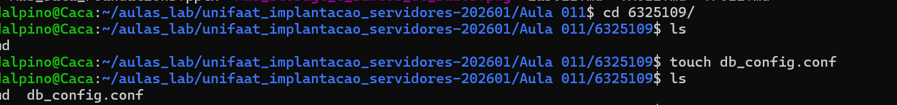

## Passo 2: Liberação de Segurança (VPC Security Group) comando: echo "DB_HOST=localhost" > db_config.conf
Foi adicionada uma regra de entrada (Inbound Rule) no Security Group da VPC para liberar o protocolo PostgreSQL na porta `5432` com origem para qualquer lugar (`0.0.0.0/0`), permitindo a conexão externa.

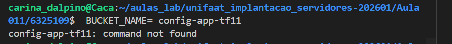

## Passo 3: Conexão e Teste de Sucesso no DBeaver - comando aws --profile default s3 ls
Com o Endpoint correto do Host configurado e as credenciais inseridas, realizou-se o teste de conectividade a partir da máquina local.
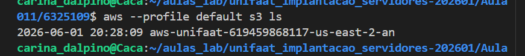

6 - Validação via AWS CLI e Ferramentas Locais
1. Configuração de Credenciais AWS
Verificação do perfil e chaves configuradas localmente:
aws configure list
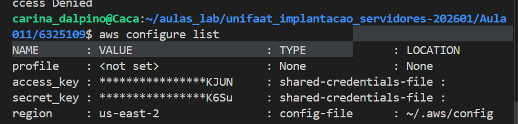

2. Teste de Conectividade com RDS
Verificação do status das instâncias de banco de dados via CLI:
aws rds describe-db-instances
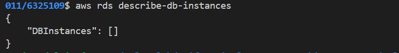

3. Instalação do Cliente PostgreSQL
Validação da instalação local da ferramenta de linha de comando psql:
psql --version
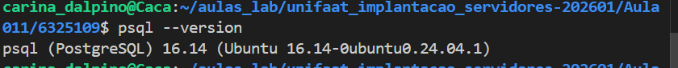

4. Variável de Ambiente do Endpoint RDS
Exportação e validação da variável de ambiente com o endpoint da instância para automação de scripts:
export RDS_ENDPOINT="rds-tf011-6325109.c123456789.us-east-1.rds.amazonaws.com"
echo $RDS_ENDPOINT
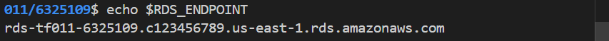

Parte 2: Exercício Prático de Criação e Manipulação de Dados
1. Criar uma Instância RDS PostgreSQL
Nova instância provisionada e ativa no painel da AWS.
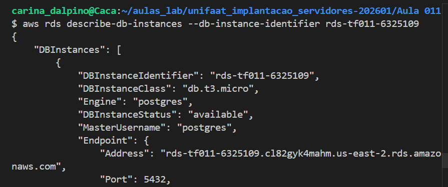

2. Conectar ao Banco de Dados via DBeaver
Configuração dos parâmetros de conexão utilizados na ferramenta DBeaver:
Host: rds-tf011-6325109.cl82gyk4mahm.us-east-2.rds.amazonaws.com
Port: 5432
Database: postgres
Username: postgres
senha: ?

3. Criar Tabela de Alunos
Execução do script DDL para criação da tabela base do exercício.
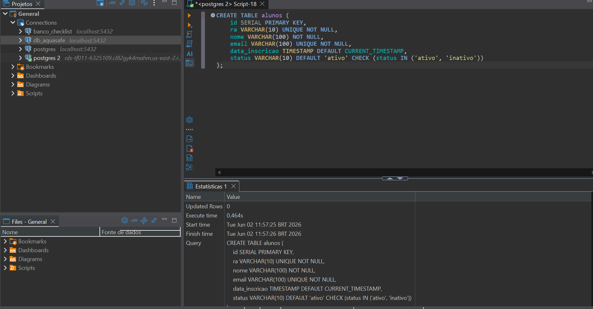

4. Inserir Dados de Exemplo
Execução dos comandos INSERT para popular a tabela com dados fictícios de estudantes.
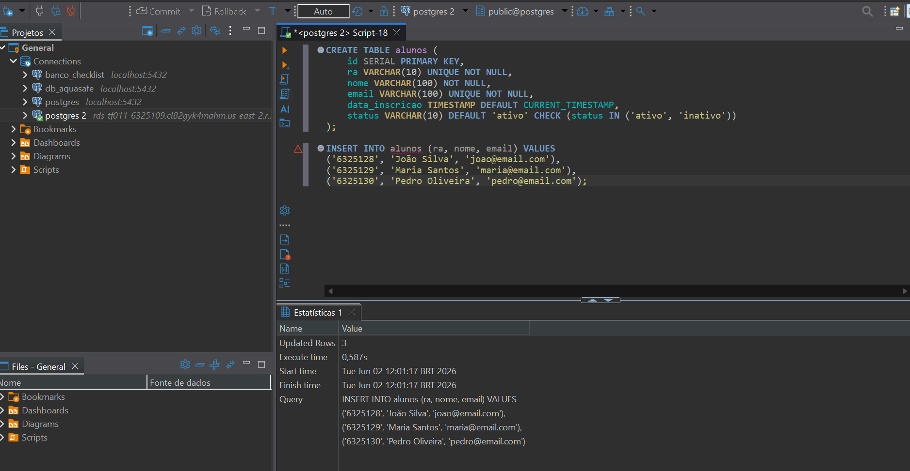

5. Verificar Dados
Validação dos dados inseridos através de uma consulta estruturada:
SELECT * FROM alunos;
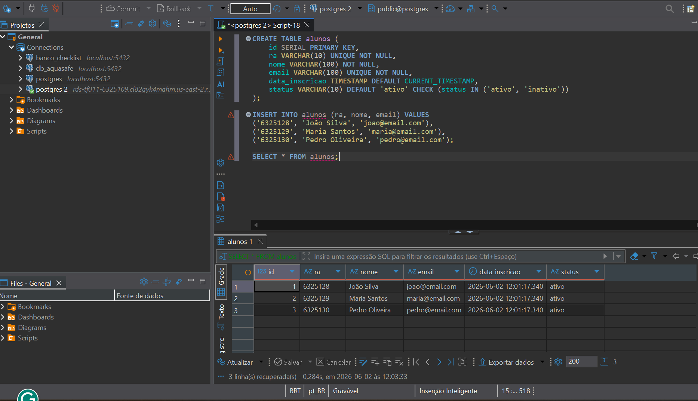

6. Criar um Backup (Snapshot) do RDS
Geração do Snapshot manual na AWS para garantir a persistência e segurança dos dados manipulados.
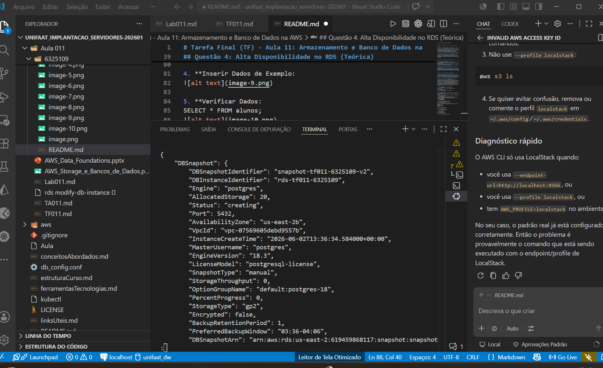

