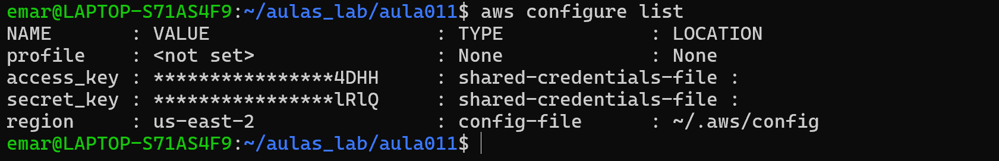
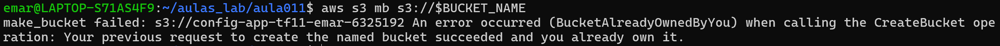
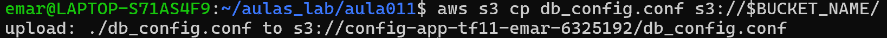
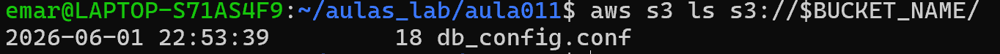

1-a)O principal caso de uso do Amazon S3 é o armazenamento de objetos.Em ambientes DevOps, o S3 é frequentemente utilizado para armazenar artefatos de aplicações, backups e arquivos de configuração.

b)O Amazon S3 é um serviço regional.
A taxa de 99.999999999% (Onze Noves) representa a durabilidade dos dados, indicando uma probabilidade extremamente baixa de perda de informações armazenadas

2-a)A principal diferença é que o EBS é destinado ao armazenamento local de uma instância, enquanto o EFS permite compartilhamento entre múltiplas instâncias.

b)O serviço mais adequado para armazenar o Sistema Operacional e os executáveis da aplicação é o Amazon EBS, pois oferece armazenamento em blocos com alta performance e baixa latência, ideal para discos de boot.

3-a)Ao utilizar o Amazon RDS, a AWS assume diversas responsabilidades administrativas, entre elas:

Aplicação de patches e atualizações do banco de dados.
Realização automática de backups e recuperação.

Outras tarefas incluem monitoramento, provisionamento de infraestrutura e substituição de hardware defeituoso.

b)A principal desvantagem do RDS é a menor flexibilidade administrativa.

O usuário não possui acesso completo ao sistema operacional do servidor e nem controle total sobre configurações avançadas do banco de dados, como teria em uma instância EC2 autogerenciada.

4-a)Quando o recurso Multi-AZ é habilitado:

A AWS cria automaticamente uma instância secundária em outra Availability Zone.
Os dados são replicados de forma síncrona.
Em caso de falha da instância principal, ocorre failover automático.

b)Standby (Multi-AZ)
Utilizado para alta disponibilidade.
Não pode receber consultas.
Assume automaticamente em caso de falha.
Read Replica
Utilizada para escalabilidade de leitura.
Pode receber consultas SELECT.
Não realiza failover automático da instância principal.
______________________________________________________________

5)
5.1) Criação do Arquivo:
touch db_config.conf 
ou 
echo "configuracao_teste" > db_config.conf

5.2)aws s3 cp db_config.conf s3://config-app-tf11/

5.3)aws s3 ls s3://config-app-tf11/
______________________________________________________________

![psql --version]](image-1.png)
![aws rds describe-db-instances]](image-2.png)

