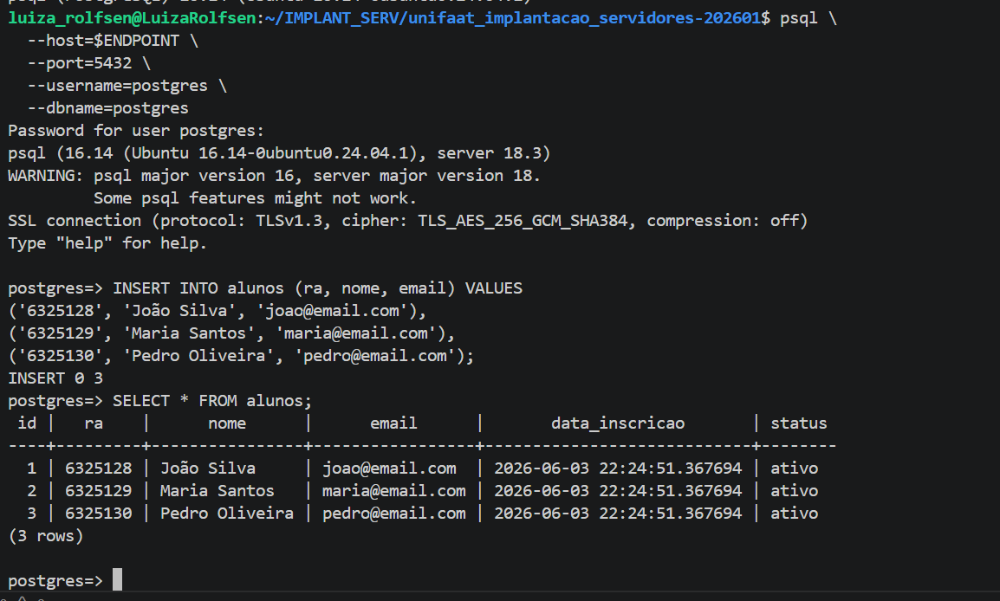

Claro. Copie e cole diretamente nos espaços de resposta do seu README.

---

# Questão 1: Armazenamento de Objetos (S3)

### a) Qual é o principal caso de uso para o S3 em um contexto de aplicação Web e DevOps?

**R:** O Amazon S3 é utilizado para armazenar arquivos e objetos, como imagens, vídeos, backups, logs, arquivos de configuração e conteúdos estáticos de aplicações web. Também pode ser utilizado para armazenamento de grandes volumes de dados, servindo como Data Lake para aplicações de análise e processamento de informações.

### b) O S3 é um serviço global ou regional? Qual característica do S3 (durabilidade ou disponibilidade) é expressa pela taxa "Onze Noves" (99.999999999%)?

**R:** O Amazon S3 é um serviço regional, pois os buckets são criados em uma região específica da AWS. A taxa de 99.999999999% representa a durabilidade dos dados armazenados, indicando uma probabilidade extremamente baixa de perda dos objetos armazenados.

---

# Questão 2: Armazenamento de Blocos vs. Arquivos (EBS/EFS)

### a) Qual é a diferença fundamental entre Amazon EBS e Amazon EFS?

**R:** O Amazon EBS fornece armazenamento em blocos que normalmente é conectado a uma única instância EC2, funcionando como um disco rígido virtual. Já o Amazon EFS fornece um sistema de arquivos compartilhado que pode ser acessado simultaneamente por múltiplas instâncias EC2.

### b) Considerando uma aplicação Web de 3 camadas, qual seria mais adequado para armazenar o Sistema Operacional e o executável da aplicação? Justifique.

**R:** O Amazon EBS é mais adequado para armazenar o sistema operacional e os arquivos executáveis da aplicação, pois oferece armazenamento persistente em blocos com baixa latência e alto desempenho, características ideais para esse tipo de utilização.

---

# Questão 3: Banco de Dados Gerenciado (RDS)

### a) Cite duas responsabilidades de gerenciamento que a AWS assume ao usar o RDS.

**R:**

* Aplicação de atualizações e patches de segurança do banco de dados.
* Realização de backups automáticos e recuperação dos dados.

### b) Qual é a principal desvantagem de usar o RDS em comparação com um banco de dados instalado em uma EC2?

**R:** A principal desvantagem é a redução do controle sobre o sistema operacional e sobre configurações avançadas do banco de dados, quando comparado a uma instalação realizada diretamente em uma instância EC2.

---

# Questão 4: Alta Disponibilidade no RDS

### a) Descreva o que acontece quando você habilita o Multi-AZ para uma instância RDS.

**R:** Quando o Multi-AZ é habilitado, a AWS cria automaticamente uma instância de standby em outra Availability Zone e replica os dados da instância principal de forma síncrona. Em caso de falha da instância principal, ocorre failover automático para a instância de standby.

### b) Qual a diferença conceitual entre uma instância de Standby (Multi-AZ) e uma Read Replica?

**R:** A instância Standby é utilizada para alta disponibilidade e recuperação de falhas, não sendo acessada diretamente pelos usuários. Já a Read Replica é utilizada para distribuir consultas de leitura e melhorar o desempenho da aplicação, podendo receber conexões de leitura.

---

# Questão 5: Tarefa Prática Integrada

### 1. Criação do Arquivo


### 2. Upload para o Bucket S3

### 3. Verificação do Upload

---

# Questão 6: Evidências Práticas

## 1. Configuração das Credenciais AWS

Comando utilizado:

```bash
aws configure list
```

### Evidência

Cole a imagem abaixo:

```md

```

---

## 2. Teste de Conectividade com o Serviço RDS

Comando utilizado:

```bash
aws rds describe-db-instances
```

### Evidência


---

## 3. Instalação do Cliente PostgreSQL

Comando utilizado:

```bash
psql --version
```

Resultado obtido:

```text
psql (PostgreSQL) 16.14
```

---

## 4. Variável de Ambiente do Endpoint RDS

Comandos utilizados:

```bash
export ENDPOINT="rds-tf011-6325257.c9qkk8ggojdl.us-east-2.rds.amazonaws.com"

echo $ENDPOINT
```

### Evidência

```md

```

---

## 5. Criação da Instância PostgreSQL

Instância criada:

```text
rds-tf011-6325257
```

### Evidência

```md

```

---

## 6. Consulta da Instância Criada

Comando utilizado:

```bash
aws rds describe-db-instances \
  --db-instance-identifier rds-tf011-6325257 \
  --region us-east-2
```

Status obtido:

```text
available
```

### Evidência

```md

```

---

## 7. Conexão com o PostgreSQL

Comando utilizado:

```bash
psql \
  --host=$ENDPOINT \
  --port=5432 \
  --username=postgres \
  --dbname=postgres
```


---

## 8. Criação da Tabela Alunos

Script executado:

```sql
CREATE TABLE alunos (
    id SERIAL PRIMARY KEY,
    ra VARCHAR(10) UNIQUE NOT NULL,
    nome VARCHAR(100) NOT NULL,
    email VARCHAR(100) UNIQUE NOT NULL,
    data_inscricao TIMESTAMP DEFAULT CURRENT_TIMESTAMP,
    status VARCHAR(10) DEFAULT 'ativo' CHECK (status IN ('ativo', 'inativo'))
);
```

---

## 9. Inserção dos Dados

Script executado:

```sql
INSERT INTO alunos (ra, nome, email) VALUES
('6325128', 'João Silva', 'joao@email.com'),
('6325129', 'Maria Santos', 'maria@email.com'),
('6325130', 'Pedro Oliveira', 'pedro@email.com');
```

### Evidência


---

## 10. Consulta dos Dados

Script executado:

```sql
SELECT * FROM alunos;
```

---

## 11. Criação do Snapshot

Comando utilizado:

```bash
aws rds create-db-snapshot \
  --db-instance-identifier rds-tf011-6325257 \
  --db-snapshot-identifier snapshot-tf011-6325257 \
  --region us-east-2
```

### Evidência



---

# Conclusão

Durante a atividade foram utilizados os serviços Amazon S3 e Amazon RDS da AWS. Foi possível configurar o ambiente, criar uma instância PostgreSQL gerenciada, conectar ao banco de dados, criar tabelas, inserir registros, consultar informações e gerar um snapshot para backup da instância.


## Sessão de Entrega
O aluno deve:

1. Fazer um fork deste repositório ou atualizar o fork feito na aula anterior.
2. Atualizar o repositório local se já estiver clonado.
3. Dentro da pasta `Aula 011` criar uma pasta com o seu RA.
4. Colocar dentro dessa pasta os artefatos criados (comandos simulados, desenhos, prints ou evidências solicitadas).
5. Criar um `README` dentro da pasta do RA com:
   - as respostas das perguntas;
   - observações sobre as ferramentas e comandos usados;
   - descrição de cada print de evidência prática.
6. Fazer um pull request com as alterações para o meu repositório.
   - O título do pull request deve ser: `RA - Nome do Aluno`.

> **⚠️ Importante**
>
> - As respostas devem estar no `README` dentro da pasta com o RA do aluno.
> - Depois de atualizar o fork, crie a pasta do seu RA em `Aula 011` e adicione os artefatos antes de abrir o pull request.
> - O pull request só será aceito até as 22:30 de hoje.
> - Se os artefatos não estiverem na pasta `Aula 011`, será descontado 0,5 ponto do TF.
> - Se o Titulo da PR não estiver no padrão `RA - Nome do Aluno`, será descontado 0,5 ponto do TF.

## Como atualizar o fork feito anteriormente
Se você já possui um fork deste repositório, atualize-o antes de começar a tarefa: